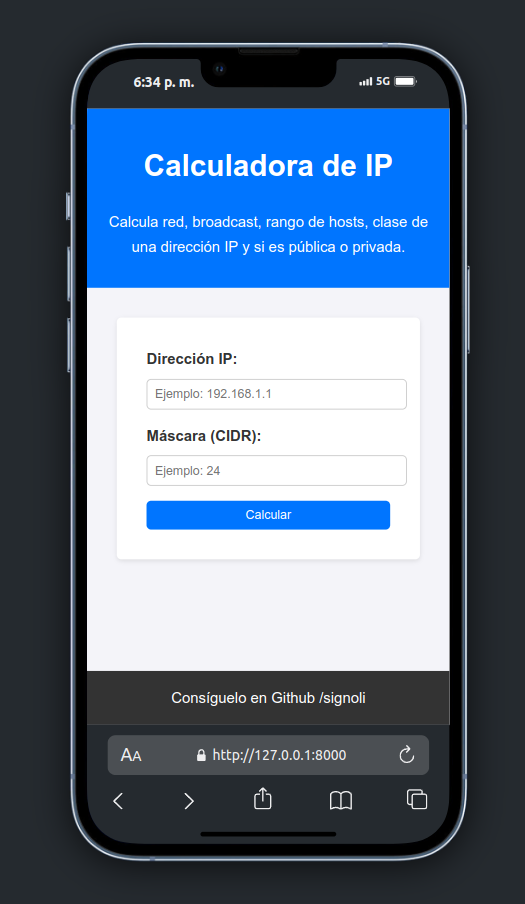
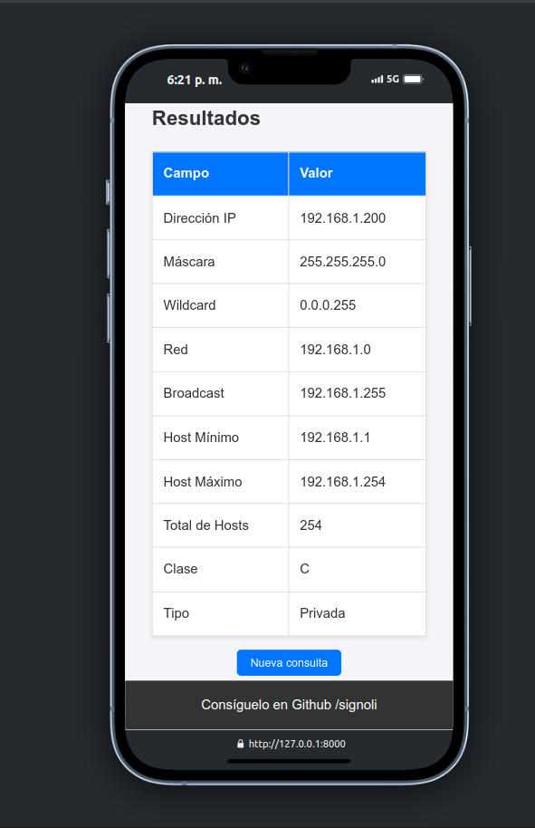

## Requisitos
- Tener python instalado.

## Instrucciones
- Clonar el repositorio.
- Crear un enterno virtual: ```virtualenv venv```
- Ejecutar el entrono virtual: ```source venv/bin/activate``` 
- Moverse al directorio: ```cd calculadora_ip```
- Instalar Flask con el comando: ```pip install flask```
- ejecutar el script app.py: ```python app.py```

## Observacion
- La app trabaja en el puerto 8000, de tenerlo ocupado modificar el argumento port en la linea 76 ```port=8000```


## Capturas
- Formulario de entrada de IP y Mascara:




- Resultados de los calculos segun la entrada: 


